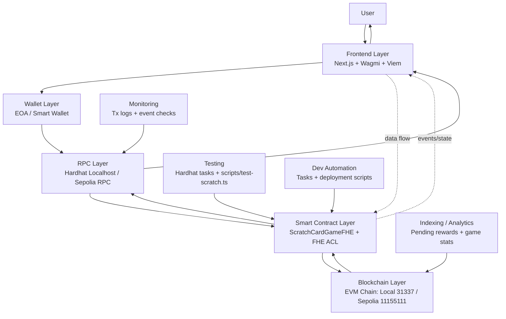

# Scratch Card Reactive Game (Hardhat)

Hardhat project for the Zama FHE scratch-card contract.

## Contract
- `contracts/ScratchCardReactiveGame.sol`

Core flow:
1. User calls `scratchCard()` and pays `scratchPrice`
2. Contract emits `ScratchRequested`
3. Reactivity handler triggers `_onEvent(...)`
4. Reward is computed and added to `pendingRewards`
5. User claims with `claimRewards(amount)`

## User Flow Diagram


## Current Reward Model
- 55% -> `0`
- 20% -> `scratchPrice`
- 10% -> `scratchPrice * 2`
- 7% -> `scratchPrice * 3`
- 5% -> `scratchPrice * 4`
- 3% -> `scratchPrice * 5`

## Prerequisites
Create `.env`:
```env
PRIVATE_KEY=0x...
SEPOLIA_RPC_URL=https://sepolia.infura.io/v3/<key>
SCRATCH_CARD_CONTRACT=0x14c1386e45401Fbbed5af46E67E7B602C519E972
SCRATCH_PRICE_WEI=100000000000000000
```

## Install
```bash
npm install
```

## Useful Scripts
```bash
npm run scratch-deploy
npm run scratach-subscribe
npm run test-scratch
npm run batch-scratch
npm run scratch-manage -- events
```

## Script Notes
- `scratch-deploy`: deploys with single constructor arg `scratchPrice`
- `scratch-subscribe`: creates reactivity subscription for `ScratchRequested`
- `test-scratch`: sends scratch tx, waits for reactive settlement, claims pending
- `batch-scratch`: generates wallets, funds each, then loops scratch/claim per wallet until balance is too low for next round
- `scratch-manage`: inspect/cancel subscriptions + check key events

### Batch Scratch Env (optional)
```env
BATCH_WALLET_COUNT=10
BATCH_FUND_PER_WALLET_STT=2
BATCH_GAS_RESERVE_STT=0.01
BATCH_MAX_ROUNDS_PER_WALLET=200
BATCH_REACTIVITY_POLLS=20
BATCH_REACTIVITY_POLL_MS=2000
BATCH_SAVE_WALLETS=false
```

If you set `BATCH_SAVE_WALLETS=true`, generated wallet private keys are saved to a local JSON file.

## Explorer
- Address: `https://sepolia.etherscan.io/address/<contract>`
- Tx: `https://sepolia.etherscan.io/tx/<txHash>`
